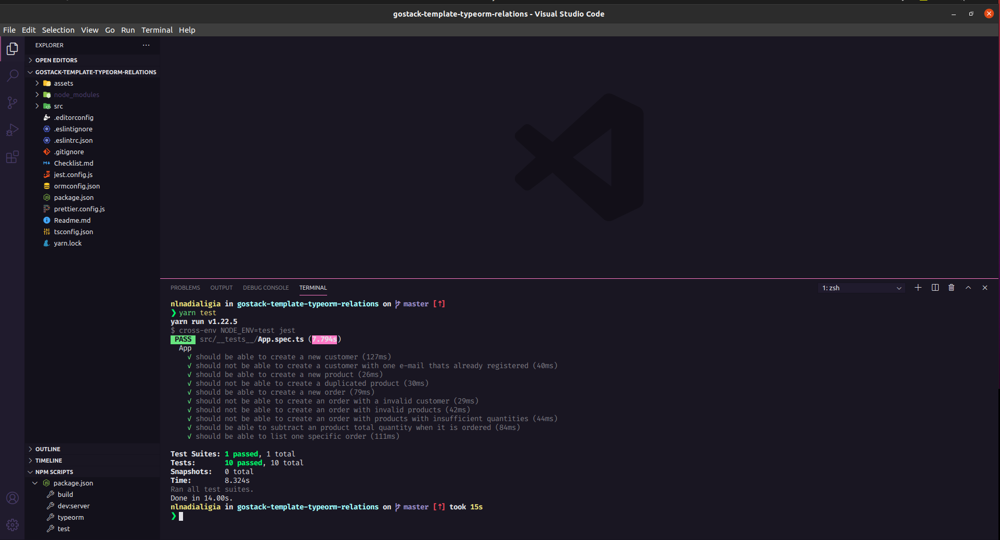

<h1 align="center">Desafio 09: Relacionamentos com banco de dados no Node.js</h1>
<p align="center">
  
</p>


<p align="center">
  

  <a href="license.md">
  
  </a>
</p>

___

<h3 align="center">
  <a href="#information_source-sobre">Sobre</a>&nbsp;|&nbsp;
  <a href="#rocket-tecnologias-frameworks-dependencias">Tecnologias</a>&nbsp;|&nbsp;
  <a href="#licença">Licença</a>
</h3>

___

<br>

## :information_source: Sobre

<br>

Criação de uma aplicação que deve permitir a criação de clientes, produtos e pedidos, onde o cliente pode gerar novos pedidos de compra de certos produtos, como um pequeno e-commerce.

<br>

### :pushpin: Rotas da aplicação

<br>

**`POST /customers`**: A rota deve receber `name` e `email` dentro do corpo da requisição, sendo o name o nome do cliente a ser cadastrado. Ao cadastrar um novo cliente, ele deve ser armazenado dentro do seu banco de dados e deve ser retornado o cliente criado. Ao cadastrar no banco de dados, na tabela customers deverá possuir os campos `name, email, created_at, updated_at`.

**Dica:** *Antes de criar um novo cliente, sempre verifique se já existe um cliente com o mesmo e-mail. Caso ela exista, retorne um erro.*

**`POST /products`**: Essa rota deve receber `name`, `price` e `quantity` dentro do corpo da requisição, sendo o name o nome do produto a ser cadastrado, price o valor unitário e quantity a quantidade existente em estoque do produto. Com esses dados devem ser criados no banco de dados um novo produto com os seguintes campos: `name, price, quantity, created_at, updated_at`.

**Dica 1:** *Antes de criar um novo produto, sempre verifique se já existe um produto com o mesmo nome. Caso ela exista, retorne um erro.*

**Dica 2:** *Para o campo price, você pode utilizar o type como decimal na sua migration, passando também as propriedades precision e scale.*

**`POST /orders/`**: Nessa rota você deve receber no corpo da requisição o `customer_id` e um array de products, contendo o `id` e a `quantity` que você deseja adicionar a um novo pedido. Aqui você deve cadastrar na tabela orders um novo pedido, que estará relacionado ao `customer_id informado, created_at e updated_at`. Já na tabela orders_products, você deve armazenar o` product_id, order_id, price e quantity, created_at e updated_at`.

**Dica 1:** Nessa funcionalidade, você precisará fazer um relacionamento de N:N entre produtos e pedidos, onde vários produtos podem estar em vários pedidos, com isso você deve sempre armazenar o valor do produto no momento da compra e a quantidade pedida na tabela pivô com nome de `orders_products`, essa tabela vai ter os campos `id, order_id, product_id, quantity, price, created_at e updated_at`. Para esse tipo de relacionamento, você pode verificar na documentação do TypeORM sobre como fazer relacionamento muitos-para-muitos com propriedades customizadas.

**Dica 2:** Além disso, você pode também utilizar o método de cascade do TypeORM, que irá adicionar na sua tabela order_products os produtos que você passar por parametro para a entidade de orders automaticamente, você pode saber mais sobre isso aqui: Opção de cascade

**Dica 3:** A sua requisição do insomnia deve enviar um JSON com o formato parecido com esse:

```json
{
  "customer_id": "e26f0f2a-3ac5-4c21-bd22-671119adf4e9",
  "products": [
    {
      "id": "ce0516f3-63ae-4048-9a8a-8b6662281efe",
      "quantity": 5
    },
    {
      "id": "82612f2b-3f31-40c6-803d-c2a95ef35e7c",
      "quantity": 7
    }
  ]
}
```

**Dica 4:** Uma chamada a essa rota deve retornar os dados do cliente, produtos do pedido e id do pedido, num formato parecido com o seguinte:

```json
{
  "id": "5cbc4aa2-b3dc-43f9-b121-44c1e416fa92",
  "created_at": "2020-05-11T07:09:48.767Z",
  "updated_at": "2020-05-11T07:09:48.767Z",
  "customer": {
    "id": "e26f0f2a-3ac5-4c21-bd22-671119adf4e9",
    "name": "Rocketseat",
    "email": "oi@rocketseat.com.br",
    "created_at": "2020-05-11T06:20:28.729Z",
    "updated_at": "2020-05-11T06:20:28.729Z"
  },
  "order_products": [
    {
      "product_id": "ce0516f3-63ae-4048-9a8a-8b6662281efe",
      "price": "1400.00",
      "quantity": 5,
      "order_id": "5cbc4aa2-b3dc-43f9-b121-44c1e416fa92",
      "id": "265b6cbd-3ab9-421c-b358-c2e2b5b3b542",
      "created_at": "2020-05-11T07:09:48.767Z",
      "updated_at": "2020-05-11T07:09:48.767Z"
    },
    {
      "product_id": "82612f2b-3f31-40c6-803d-c2a95ef35e7c",
      "price": "500.00",
      "quantity": 7,
      "order_id": "5cbc4aa2-b3dc-43f9-b121-44c1e416fa92",
      "id": "ae37bcd6-7be7-47b9-b277-afee35aab4e4",
      "created_at": "2020-05-11T07:09:48.767Z",
      "updated_at": "2020-05-11T07:09:48.767Z"
    }
  ]
}
```

**`GET /orders/:id`**: Essa rota deve retornar as informações de um pedido específico, com todas as informações que podem ser recuperadas através dos relacionamentos entre a tabela `orders`, `customers` e `orders_products`.

**Dica:** Aqui você pode utilizar a opção eager do TypeORM ou passar a opção relations para o método findOne do TypeORM, informando os nomes das tabelas que você deseja buscar o relacionamento.

<br>

### :pushpin: Links úteis
- [Cascade option TypeORM](https://github.com/typeorm/typeorm/blob/master/docs/relations.md#cascade-options)
- [Relacionamento many-to-many personalizado](https://github.com/typeorm/typeorm/blob/master/docs/many-to-many-relations.md#many-to-many-relations-with-custom-properties)
- [Eager loading com TypeORM](https://github.com/typeorm/typeorm/blob/master/docs/eager-and-lazy-relations.md#eager-relations)
- [Opções de relacionamentos do TypeORM](https://github.com/typeorm/typeorm/blob/master/docs/find-options.md)

<br>

### :pushpin: Específicação dos testes

Para esse desafio, temos os seguintes testes:

<h3 align="center">
⚠️ Antes de rodar os testes, crie um banco de dados com o nome gostack_desafio09_tests para que todos os testes possam executar corretamente ⚠️
</h3>

<br>

- `should be able to create a new customer`: Para que esse teste passe, a  aplicação deve permitir que um cliente seja criado, e retorne um json com o cliente criado.

- `should not be able to create a customer with one e-mail thats already registered`: Para que esse teste passe, sua aplicação deve retornar um erro quando você tentar cadastrar um cliente com um e-mail que já esteja cadastrado no banco de dados.

- `should be able to create a new product`: Para que esse teste passe, sua aplicação deve permitir que um produto seja criado, e retorne um json com o produto criado.

- `should not be able to create a duplicated product`: Para que esse teste passe, sua aplicação deve retornar um erro quando você tentar cadastrar um produto com um nome que já esteja cadastrado no banco de dados.

- `should be able to create a new order`: Para que esse teste passe, sua aplicação deve permitir que um pedido seja criado, e retorne um json com o todos os dados do pedido criado.

- `should not be able to create an order with a invalid customer`: Para que esse teste passe, sua aplicação não deve permitir a criação de um novo pedido com um cliente que não existe no banco de dados, retornando um erro.

- `should not be able to create an order with invalid products`: Para que esse teste passe, sua aplicação não deve permitir a criação de um novo pedido com um produtos que não existem no banco de dados, retornando um erro caso um ou mais dos produtos enviados não exista no banco de dados.

- `should not be able to create an order with products with insufficient quantities`: Para que esse teste passe, sua aplicação não deve permitir a criação de um novo pedido com um produtos que não possuem quantidade disponível, retornando um erro caso um ou mais dos produtos enviados não possua a quantidade necessária.

- `should be able to subtract an product total quantity when it is ordered`: Para que esse teste passe, sua aplicação deve permitir que, quando um novo pedido for criado, seja alterada a quantidade total dos produtos baseado na quantidade pedida.

- `should be able to list one specific order`: Para que esse teste passe, você deve permitir que a rota orders/:id retorne um pedido, contendo todas as informações do pedido com o relacionamento de customer e order_products.

<h4 align="center">
Resultado: <br>

</h4>

<br>

## :rocket: Tecnologias, Frameworks e Dependências

- [NodeJS](https://nodejs.org/en/)
- [ExpressJS](https://expressjs.com/pt-br/)
- [TypeScript](https://www.typescriptlang.org/)
- [Eslint](https://eslint.org/)
- [Prettier](https://prettier.io/)
- [Uuid](https://www.npmjs.com/package/uuid)
- [Cors](https://www.npmjs.com/package/cors)
- [Tsrynge](https://github.com/microsoft/tsyringe)
- [Typeorm](https://typeorm.io/#/)
- [Jest](https://github.com/facebook/jest)

<br>

## Licença

Esse projeto está sob a licença MIT. Veja o arquivo [LICENSE](LICENSE) para mais detalhes.
